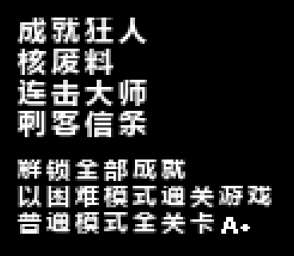
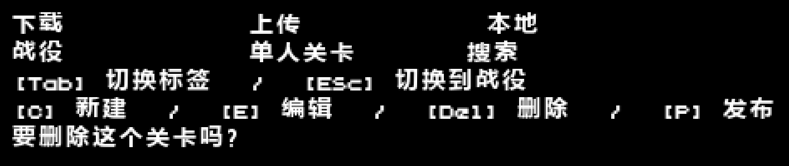
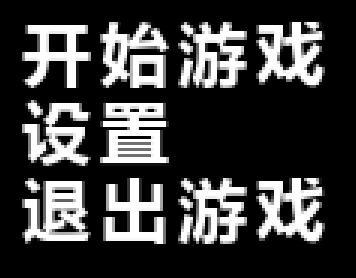
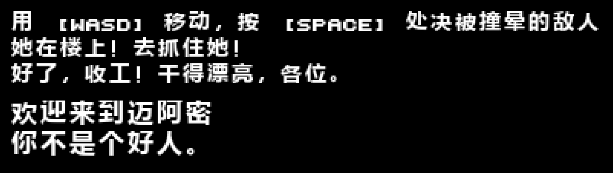
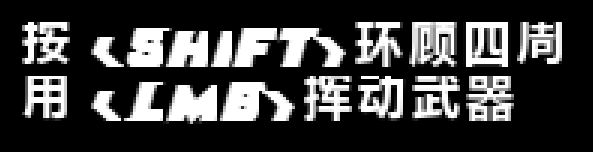
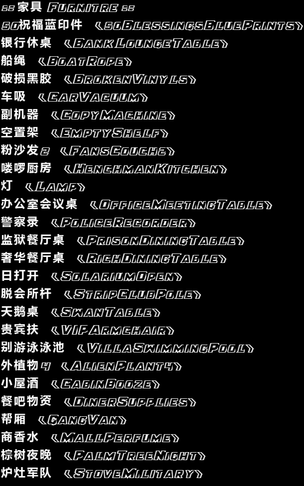
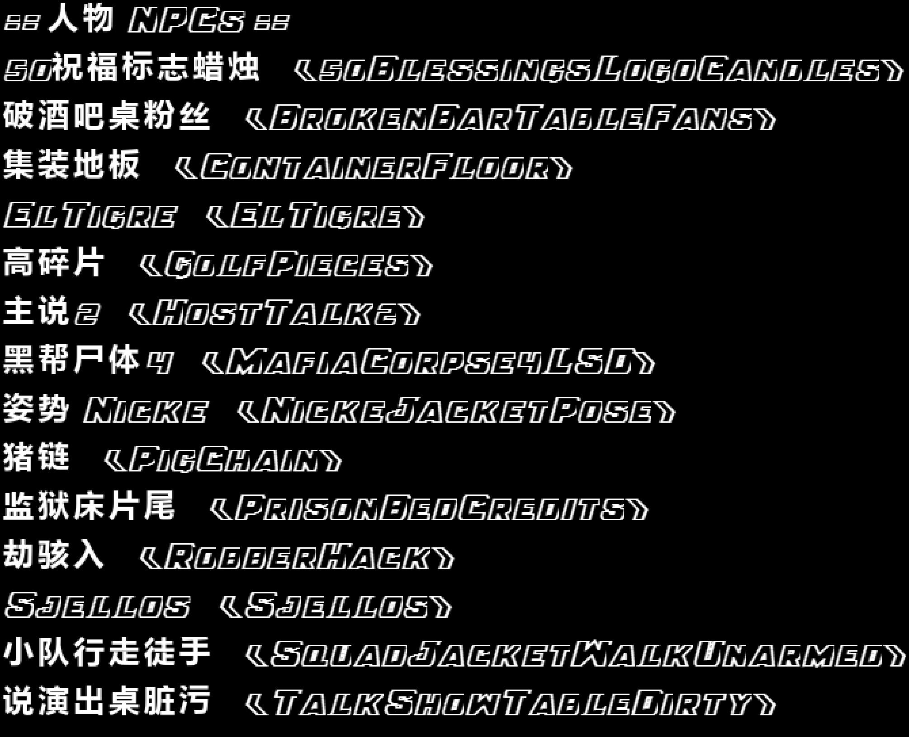

# Hotline Miami 2 简体中文汉化 / Simplified Chinese Localization

> 把《迈阿密热线 2：错号》彻底变成中文——**菜单、操作提示、HUD、对话、字幕、章节标题、成就页、关卡编辑器（里外全部，含物品页）**，一个不落。
> 一键安装、一键还原；不碰存档，**Steam 成就 ID 一字不改**，成就照常解锁。

**适用版本**：Steam 版《Hotline Miami 2: Wrong Number》 ｜ **系统**：Windows 10 / 11 ｜ **当前版本 v1.2**

上图不是设计稿，是把汉化后的游戏字体文件重新解出来渲染的真实结果。

---

## ✨ 特性

- **2889 条游戏文本全翻译**：菜单 / 操作提示 / HUD / 对话 / 字幕 / 章节标题，覆盖全部剧情与玩法内容；
- **成就页也是中文**：成就名与描述硬编码在 `HotlineMiami2.exe` 里（**不读 WAD 文本库**），只改 WAD 永远是英文。本补丁对 exe 做**等长字节替换**——偏移不变、Steam 成就 ID 不变；
- **关卡编辑器彻底汉化，里外都翻**：编辑器外壳（下载/上传/本地/战役/单人关卡/搜索、快捷键提示、确认弹窗）**加上**编辑器画布内部的页签（建造/物品/敌人/杂项/关卡）、画布操作提示、**敌人页的行为名与说明**（静止/巡逻/随机/胖/狗/闪避/待机）、**各类弹窗与警告**、**过场编辑器动作描述**、角色与敌人选择弹窗、`FILE/EDIT/HELP` 菜单、Perks 强化项、设置项等，共 **485 条**硬编码文案已全部处理。**这是市面上多数汉化补丁漏掉的一块**；
- **编辑器「物品页」1308 个物品名全部汉化（本版新增）**：物品页列出的是**贴图资源名本身**（`Atlases/Sprites/Furniture/**`、`NPCs/**` 的文件名），游戏**没有"显示名"层**，改文本库永远是英文——只能**直接改名**。本补丁把这 1308 个资源名改成中文（家具 799 + 人物 509），并在 WAD 内替换 **11,604 处**引用，全部**等长改名**（WAD 体积一字节未变），旧名残留 0、冲突 0、缺字形 0。另有 32 条人名/乐队名按惯例保留英文；
- **中文用微软雅黑粗体渲染**：原版字体是粗斜体像素字，中文字形若用常规体在 10px 下横画会整根丢失。本补丁给 76 套字体各注入 **1600 个汉字字形**，字号取该字体行高允许的最大值，字距重算，**逐字比对 0 缺字**；
- **按键标记零错漏**：`[WASD]`、`[SPACE]`、`[LMB]`、`[Del]` 等标记逐条比对，原样保留；
- **非破坏式注入**：文本/字体只改 WAD（新数据追加到文件末尾，其余文件字节级零改动）；物品改名严格等长，4522 个条目的偏移全部不动；exe 只做等长文本替换。安装前自动备份 `hlm2_data_desktop.wad.bak` 与 `HotlineMiami2.exe.bak`；
- **纯 PowerShell 安装器**：不需要 Python、不需要额外运行库；安装器**严格按文件偏移**定位替换，不带模糊搜索，重复执行完全幂等（连跑三次哈希不变）。

## 📦 下载

前往 [**Releases**](../../releases) 页面，下载最新的 `HotlineMiami2_CN_Pack_v*.zip`（约 88 MB，只含汉化数据与安装脚本，不含任何游戏官方资源）。

## 📜 版本历史

| 版本 | 内容 | 状态 |
|---|---|---|
| **v1.2（当前）** | 文本 + **成就页** + **关卡编辑器（外壳+内部+敌人页+弹窗+过场+物品页 1308 个物品名）** 全汉化；中文用微软雅黑粗体 1600 字；安装器严格按偏移且完全幂等 | 最新 |
| v1.1 | 文本 + 成就页 + 关卡编辑器**仅外壳** | 已被 v1.2 取代 |
| v1.0 | **只汉化文本**，成就页与编辑器仍英文；轻量注入版（不改 exe） | 历史存档，仍可在 Releases 下载 |

各版详细差异、v1.1 初版（成就字迹发虚）为何被撤下、v1.2 修掉了哪两个隐患、物品页为什么必须改名，见 [**CHANGELOG.md**](CHANGELOG.md)。

## 🔧 安装

1. **完整解压**压缩包到一个文件夹（不要在压缩软件里直接双击运行）；
2. 双击 **`安装汉化.bat`**；
3. 等它显示「安装完成」（约 10–30 秒）。

安装器会自动定位 Steam 游戏目录，并把你的原版文件备份为 `hlm2_data_desktop.wad.bak` 与 `HotlineMiami2.exe.bak`。

## 🎮 开始游戏

启动游戏即中文（默认英文语言下显示中文）。若看到英文：**Options → Language → English**。

## ↩️ 还原英文原版

- 双击 **`卸载汉化.bat`**；或
- 在 Steam 中对游戏执行 **验证文件完整性**。

> 注意：Steam 验证完整性会把游戏恢复为英文原版（汉化消失）。想再玩中文，重新运行安装器即可。

## 🖼️ 效果

| 菜单 | 对话与字幕 |
|---|---|
|  |  |

| 操作提示 | 关卡编辑器 |
|---|---|
|  |  |

| 编辑器物品页（家具） | 编辑器物品页（人物） |
|---|---|
|  |  |

物品页样张为真实渲染：中文名 + 尖括号内为原英文名（用于辨识）。列表按名字排序，中文排在英文之后属正常现象。

## ❓ FAQ

**Q：安装器被 Windows SmartScreen / 杀毒软件拦截？**
安装器是免费开源的 PowerShell 脚本，未做数字签名，可能触发提示。选择「更多信息 → 仍要运行」即可；不放心可以先看源码（`install.ps1` / `uninstall.ps1` / `patch_exe.ps1` 全在里面）再运行。

**Q：为什么要改 exe？不是只动 WAD 吗？**
绝大多数文本都在 WAD 内的 `hlm2_localization.bin`。但**成就名/描述与关卡编辑器 UI 硬编码在 `HotlineMiami2.exe` 中**，文本库里一条都没有，只改 WAD 这两块永远是英文。所以安装器额外做等长替换：每个英文串原地换成中文 UTF-8 字节、尾部补 `0x00` 到原长，**所有文件偏移不变**，Steam 成就 ID 一字未动。

**Q：物品页为什么要"改资源名"这么暴力？**
因为物品页显示的不是翻译文本，而是**贴图文件名**。游戏引擎只认资源名，没有单独的显示名表，所以想让物品页出现中文，只能把资源名本身改成中文。为了不破坏文件结构，改名严格**等长**（中文字节数不足处用空格补齐），因此 WAD 目录树、贴图池偏移、关卡文件长度前缀全部无需变动。

**Q：装了本补丁后我的自制关卡 / 创意工坊关卡会怎样？**
**会受影响。** 那些关卡文件里写的是旧资源名，本补丁改名后可能找不到资源（物件/贴图丢失）。官方自带的 78 个关卡已同步改名，不受影响。要玩自制关卡时，先双击 `卸载汉化.bat` 还原英文即可。如果你从不玩自制关卡，可以忽略。

**Q：为什么有些物品名很短，比如 `ATM` 只显示一个字？**
旧英文名的长度就是可写预算（`ATM` 只有 3 字节、`Desk` 只有 4 字节）。要在等长前提下写中文，短名只能放 1～2 个汉字，这是数学限制而非翻译偷懒。

**Q：需要正版吗？**
是。本补丁只提供汉化数据并注入到**你自己购买安装的游戏**里，不包含、也不用于绕过任何正版验证。

**Q：其他版本（GOG / 学习版）能用吗？**
只测试过 Steam 版。WAD 结构一致理论上可用，风险自负，欢迎反馈。

**Q：为什么选 English 显示的是中文？**
本补丁把 English 列**替换**为中文（并额外新增一列 `Chinese (Simplified)`），这样无论引擎从哪一列取文本都是中文。想要英文随时按上文还原。

**Q：字体和原版像素风不一样？**
中文字形用的是微软雅黑粗体，属于必要妥协（原版字体只含拉丁/西里尔字形）。详见「已知限制」。

## ⚠️ 已知限制

1. **3 个成就名保持英文**：`1-800-CLEARED`、`1-800-GETHELP`、`1-800-GODDAMN`。这几个成就的**显示名就是它的 Steam API 标识符本身**，改了会导致成就无法解锁，因此**刻意保留英文**。
2. **编辑器的武器名与物件名保持英文**：`objKnife`、`objKalashnikov`、`BankWhiteBoard` 等属于关卡引用的**资源标识符**，改名会让已放置物件找不到资源。同理，`PUBLISH_CONFIRM` 等全大写标识符与 `Tab`/`Esc`/`Del` 等按键名也未翻译。
3. **约 30 条短物品名用了简写**（如 `ATM → 取`），原因见 FAQ 的"预算"一节。
4. **正文字号偏小**：原版正文字体只有 8–12 像素高，中文已放大到行高允许的上限并换用粗体，但清晰度仍不及约 20 像素的菜单文字。
5. **自制/创意工坊关卡会失效**，见上方 FAQ。
6. 离线验证做到极限：安装后逐一反查 **550 条** exe 文本、**1600 个字形**在 76 套字体中比对 0 缺字、**1308 条物品改名**全部命中且旧名残留 0、未改动的文件字节级一致，所有改动字节 100% 落在各自槽位内。正式版已由作者**在真机实机验证**。

## 🛠️ 技术原理（简）

- **文本库** `Assets/hlm2_localization.bin`：自定义二进制格式，10 种语言 × 3247 条（其中 2889 条真实文本），UTF-8。中文作为新语种追加，并把其余语种列一并填为中文。
- **字体** `Fonts/*.fnt`（BMFont XML）+ `_0.png`（8-bit 灰度掩码）：原图集原样保留，空白区追加中文字形，只更新 `chars count` / `scaleW` / `scaleH` 并追加 `<char>` 行——**原有字形坐标一个像素未动**。
- **WAD 注入**：AGAR 容器格式。新数据追加到文件末尾，只原位改写对应条目的 u64 长度/偏移字段，文件名不变 ⇒ 目录表与头部完全不动。
- **物品名改名**：以词素词典（1160 条）做最长优先匹配 + 词边界校验，生成「中文 + 英文缩写」，再空格补齐到**与原名等长**；因长度相等，容器内 4522 个条目的偏移与关卡文件长度前缀全部无需重建。
- **exe 补丁**：`patch_exe.ps1` 读取 `exe_map.json`（**550 条** `{偏移, 原文, 中文, 预算}`），**严格按偏移**逐字节比对原文后写入、NUL 补齐；不做全文模糊搜索（旧版的模糊兜底会在重复安装时误伤别的单词，已移除）。已替换过的条目按「英文已不在且已是中文」判定为幂等跳过。

## 📄 免责声明

本项目为粉丝制作的非官方汉化，与 Dennaton Games / Devolver Digital 无关。仓库与发布包**不包含任何官方游戏资源文件**，仅包含补丁数据（翻译文本与派生字体）和安装脚本。请支持正版。使用本补丁产生的任何问题由使用者自行承担。

---

## English Quick Start

Simplified Chinese localization for the Steam version of Hotline Miami 2: Wrong Number — menus, prompts, HUD, dialogue, subtitles, chapter titles, the **achievement page**, and the **level editor** (the last two are hardcoded in the .exe, not in the WAD).

1. Download `HotlineMiami2_CN_Pack_v*.zip` from [Releases](../../releases) and extract it;
2. Double-click `安装汉化.bat` — it auto-locates the game, backs up your original `hlm2_data_desktop.wad` and `HotlineMiami2.exe`, then patches them in place;
3. Launch the game — Chinese shows under the default English language;
4. To revert: run `卸载汉化.bat`, or use Steam's "Verify integrity of game files".

Coverage: 2,889 in-game strings; 550 hardcoded exe strings (65 achievement names/descriptions + 485 level-editor labels, dialogs and warnings) patched in place with length-safe byte replacement (offsets unchanged, Steam achievement IDs preserved); 1,600 CJK glyphs injected into all 76 bitmap fonts (Microsoft YaHei Bold); and **1,308 level-editor item names rewritten in Chinese** — the item list shows raw sprite resource names, so they had to be renamed in place with **byte-length-preserving** substitutions (11,604 references updated, WAD size byte-identical).

> ⚠️ **Heads-up:** because item names are resource identifiers, **custom / Steam Workshop levels that reference the old names may lose props or sprites**. The 78 official levels were renamed in sync and are unaffected. Run `卸载汉化.bat` first if you want to play custom levels.

Fan-made, unofficial, not affiliated with Dennaton Games or Devolver Digital. Saves are never touched.
